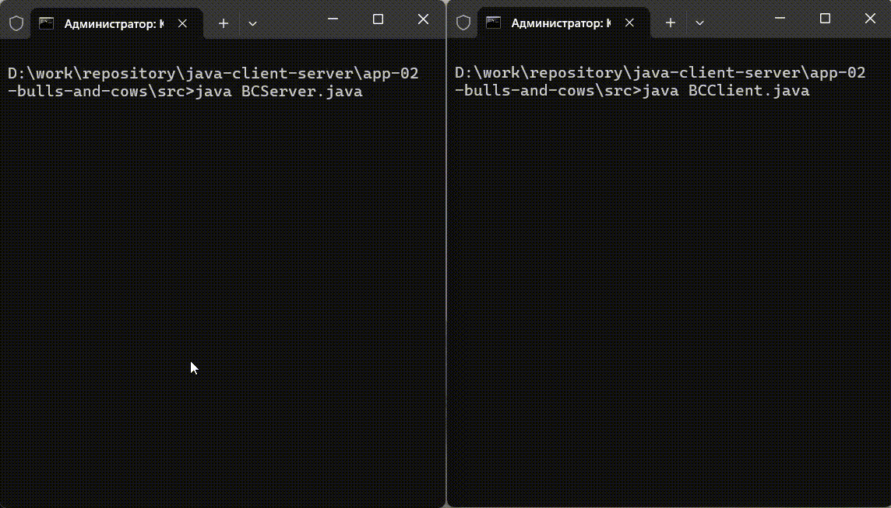

# java-client-server

Я прохожу курс 
[Java. Клиент-серверное приложение. Многопоточное](https://www.udemy.com/course/client-server)
на платформе Udemy.com.

## guess-the-number-game

После знакомства с сервером, клиентом и сокетами, преподаватель выдал задание: написать игру по типу "Угадай число",
чтобы сервер загадывал число, а клиент его угадывал.

Чтобы нахождение числа не занимало много времени, клиент ищет число не наобум, а по алгоритму "бинарный поиск".

## bulls-and-cows-game

Ещё одно задание преподавателя - написать игру "Быки и коровы". Сервер загадывает четырёхзначное число с 
неповторяющимися цифрами, а клиент пытается это число угадать. Попытка - это четырёхзначное число с неповторяющимися 
цифрами, сообщаемое серверу. Сервер отвечает, сколько цифр угадано на точной позиции (быки), и сколько угадано
на неверной позиции (коровы).

## socketor

Приложение Socketor (socket+calculator) - это клиент и сервер, два в одном флаконе :slightly_smiling_face: Класс 
Socketor можно запустить в режиме сервера или в режиме клиента. Сервер настраивается на работу с одной математической
операцией. Клиент передаёт серверу числа, над которыми следует произвести эту операцию.

В режиме сервера требуется указать порт для запуска и один из видов операции (`+`, `-`, `*`, `/`).

В режиме клиента указывается ip-адрес `127.0.0.1`, порт сервера и два числа, над которыми требуется
произвести математическую операцию, заданную при запуске сервера.

Класс Socketor содержит в себе экземпляр класса Phone, которому передана работа над операциями по запуску сервера/клиента и 
чтению/записи данных. Поэтому нельзя запустить Socketor напрямую через файл Socketor.java в папке `src`, как это было 
с предыдущими заданиями. В этом случае следует запускать скомпилированный файл Socketor.class из папки 
`out/production/java-client-server`. 

Предварительно проект следует скомпилировать любым способом:
- запустить приложение в среде разработки; 
- выполнить команду `build`/`rebuild` в панели быстрого доступа среды разработки;
- выполнить команду `javac Socketor.java -d ../../out/production/java-client-server` в командной строке.

